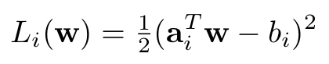
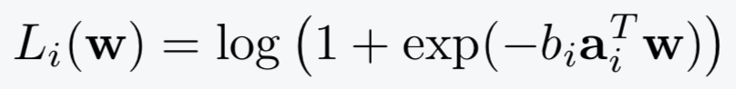
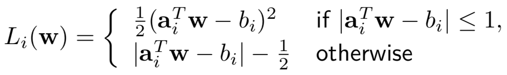
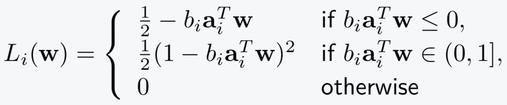
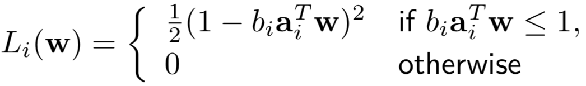

# BlitzML

BlitzML is a fast, easy-to-use solver for training some popular linear 
machine learning models.  Currently BlitzML trains:
* Sparse models with L1 regularization (Lasso-type problems).
<!-- * Linear models with piecewise losses and L2 regularization (such as linear SVMs). -->

You can use BlitzML as a Python package or C library.  BlitzML uses minimal memory copying, making it convenient to incorporate as a subproblem solver in more ellaborate algorithms.


## Problems that BlitzML solves

BlitzML trains sparse models by solving the problem 


Here are the available loss functions:

| Problem                    | Loss function      |
| ---------------------------|--------------------| 
| Lasso                      |  |
| Sparse logistic regression |  |
| Sparse Huber               |  |
| Sparse smoothed hinge      |  |
| Sparse squared hinge       |  |

<!--
Piecewise losses with l2 regularization:

| Problem                    | Loss function      |
| ---------------------------|--------------------|
| Linear SVM (hinge loss)    | .                  |
| Least absolute deviations  | .                  |
| Quantile regression        | .                  |
-->


## Use with Python

<!-- Install with `pip install blitzml`. -->
To install, clone the repository and run `pip install .` inside the project directory.

Sparse logistic regression example:
```
import blitzml
problem = blitzml.SparseLogisticRegressionProblem(A, b)
solution = problem.solve(l1_penalty=1.0)
```
`A` can be a dense NumPy array or sparse SciPy matrix.

Linear SVM example:
```
problem = blitzml.LinearSVMProblem(A, b)
solution = problem.solve(l2_penalty=1.0)
```
For detailed documentation, see https://tbjohns.github.io/BlitzML/.
