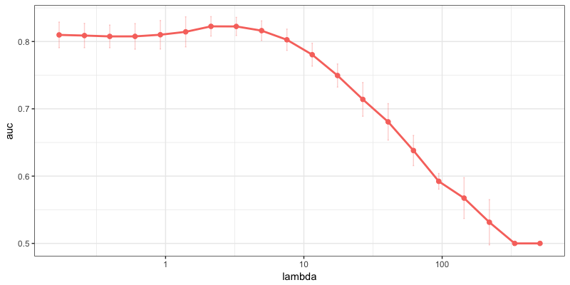

# Work in progress

## Installation

```bash
git clone https://github.com/dselivanov/BlitzML.git
R CMD INSTALL r-package
```

- At the moment package supports only logistic regression on sparse matrices in CSC format.

## Example

Here is exmple on sentiment classification. We perform 4-fold cross-validation and track AUC:
```r
library(blitzml)
library(text2vec)
library(futile.logger)
flog.threshold(INFO, "blitzml")

it = itoken(movie_review$review, tolower, word_tokenizer)
dtm = create_dtm(it, hash_vectorizer(2**14))

system.time({
  set.seed(1)
  model = BlitzMLLassoRegression$new(loss = "logistic", 
                                             lambda = "auto", 
                                             tol = 1e-2,
                                             use_working_sets = TRUE)
  cv_stat = model$cross_validate(dtm, movie_review$sentiment, n_folds = 8, cores = 1)
})

#INFO [2018-05-16 20:55:51] found max lambda: 1699.562800
#   user  system elapsed 
#  3.935   0.117   4.091 
```

And visialization of lambda path:
```r
library(data.table)
library(ggplot2)

setDT(cv_stat)
cv_stat = cv_stat[, .(cvm = mean(auc), sd = sd(auc)), keyby = .(lambda)]

ggplot(data = cv_stat, aes(x = lambda, y = cvm, col = 'red')) +
  geom_point(size = 2) +
  geom_line(size = 1) + 
  ylab("auc") +
  scale_color_discrete(guide=FALSE) +
  geom_errorbar(aes(ymin = cvm - sd, ymax = cvm + sd) , width=.01, alpha = 0.3) + 
  scale_x_log10() + 
  theme_bw()
```


